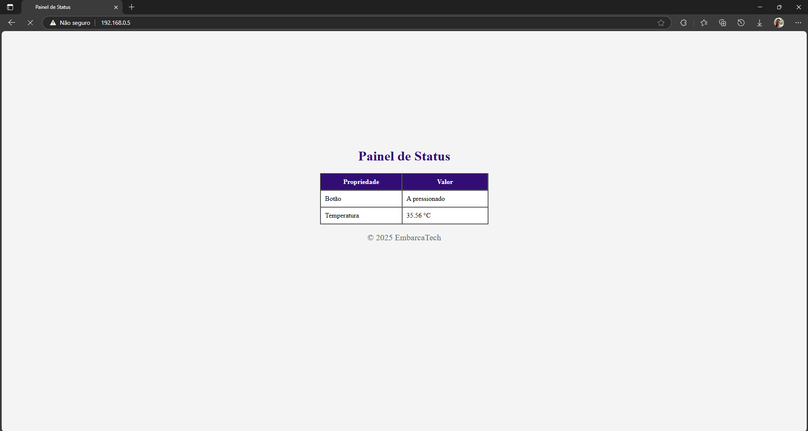
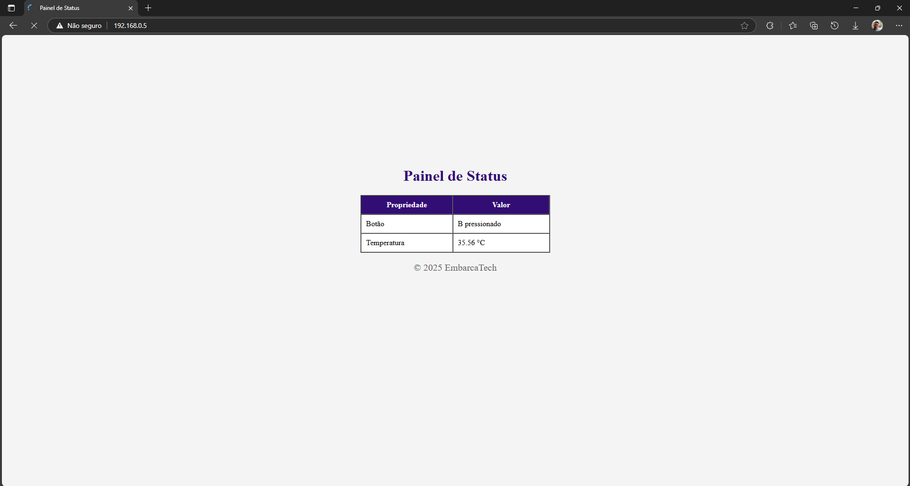
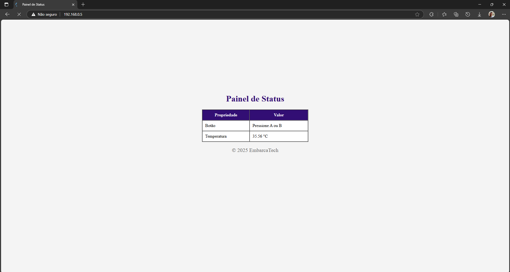

# **Controle de Botões e Sensor de Temperatura com Servidor Web**

#### Este projeto implementa um sistema para monitorar o estado de botões e a leitura de um sensor de temperatura utilizando a placa **Raspberry Pi Pico W**. As informações são enviadas em tempo real para um servidor web via Wi-Fi, permitindo a visualização dos dados em um navegador.

---

## **Funcionalidades**

- **Monitoramento de Botões:** Detecta o estado dos botões conectados à placa (pressionado ou não).
- **Leitura de Temperatura:** Captura a temperatura ambiente em tempo real utilizando um sensor integrado.
- **Servidor Web:** Exibe as informações dos botões e da temperatura em uma página HTML acessível via navegador.
- **Atualização Contínua:** Os dados são atualizados automaticamente a cada segundo.

---

## **Componentes Utilizados**

| **Componente**           | **Descrição**                     | **Conexão**          |
|---------------------------|-----------------------------------|----------------------|
| **Raspberry Pi Pico W**   | Microcontrolador principal        | -                    |
| **Botões**                | Dispositivos de entrada digital   | GPIO configurados    |
| **Sensor de Temperatura** | Sensor integrado ao microcontrolador | Interno             |
| **Módulo Wi-Fi**          | Infineon CYW43439                | Integrado ao Pico W  |

---

## **Como Funciona**

1. **Inicialização:**
   - Os botões são configurados para leitura digital através dos pinos GPIO.
   - O sensor de temperatura é inicializado para capturar leituras em tempo real.
   - O módulo Wi-Fi é configurado e conectado à rede especificada.

2. **Monitoramento de Botões:**
   - O estado dos botões é lido continuamente e exibido como "A pressionado", "B pressionado" ou "Pressione A ou B".

3. **Leitura de Temperatura:**
   - A temperatura ambiente é lida e exibida em graus Celsius.

4. **Servidor Web:**
   - As informações dos botões e da temperatura são enviadas para um servidor web e exibidas em uma página HTML.

---

## **Como Executar**

### **Pré-requisitos**
- Placa **Raspberry Pi Pico W**.
- Botões conectados aos pinos GPIO configurados no código.
- Ambiente de desenvolvimento configurado com o SDK do Raspberry Pi Pico.

### **Passos**
Clone este repositório:
```bash
git clone https://github.com/otaviossousa/button-sensor-control-webserver.git
cd button-sensor-control-webserver
```

### **Configure o arquivo `WIFI_SSID` e `WIFI_PASSWORD` no código para sua rede Wi-Fi:**
```bash
// Configurações de Wi-Fi
#define WIFI_SSID "MudeAqui" // Nome da rede Wi-Fi (SSID)
#define WIFI_PASSWORD "MudeAqui" // Senha da rede Wi-Fi
```

### **Compile o Projeto**
```bash
cd Joystick_Control_Webserver
mkdir build
cd build
cmake -G "Ninja" ..
cmake --build .
```

## **Exemplo de Saída do Web Server**

Abaixo estão exemplos das informações exibidas no servidor web, com base no estado dos botões:

### **Botão A Pressionado**


### **Botão B Pressionado**


### **Nenhum Botão Pressionado**

